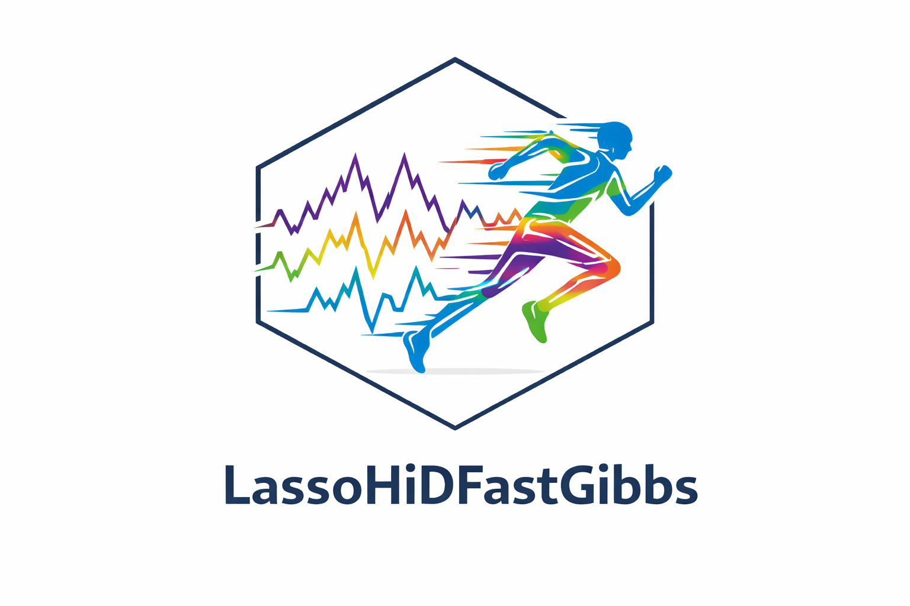

# LassoHiDFastGibbs

LassoHiDFastGibbs provides efficient Gibbs sampling algorithms for Bayesian Lasso and related shrinkage models, with a focus on improving mixing and scalability in high-dimensional settings.

This package accompanies the methodological work described in:

> *Blocked, Partially Collapsed, and Nested Gibbs Sampling for the Bayesian Lasso*

## Overview

Standard Gibbs samplers for the Bayesian Lasso can suffer from slow mixing, particularly for the residual variance and global shrinkage (penalty) parameters. This package implements a collection of alternative Gibbs sampling strategies designed to address these issues:

- **Blocked Gibbs samplers**
- **Partially collapsed Gibbs samplers**
- **Nested Gibbs samplers**

These strategies improve posterior exploration by reducing dependence between parameters and accelerating convergence. Empirical results demonstrate that partial collapsing typically yields moderate gains, while nested Gibbs samplers can lead to substantial efficiency improvements over traditional two-block Gibbs samplers.

The methods implemented here are scalable and allow Bayesian Lasso models with tens of thousands of predictors to be fitted in seconds to minutes. Extensions to the horseshoe prior are also included, with similar efficiency gains observed.

## Main functionality

The package provides fast implementations of Gibbs samplers for Bayesian linear regression models with shrinkage priors. Key functions include:

- Bayesian Lasso Gibbs samplers using two-block, blocked, and partially collapsed updates
- Penalized Gibbs samplers with different collapsing schemes for regression coefficients, variance, and penalty parameters
- Nested Gibbs samplers for improved mixing in high-dimensional problems
- Utilities for normalization and MCMC diagnostics

See the package help index (`help(package = "LassoHiDFastGibbs")`) for a complete list of available functions and detailed documentation.

## Installation

### CRAN

You can install the stable release from CRAN with:

```r
install.packages("LassoHiDFastGibbs")
```
### Development version

The development version, which may include new features or bug fixes not yet released on CRAN, can be installed from GitHub:
```r
# install.packages("pak")
pak::pak("MJDavoudabadi/LassoHiDFastGibbs")
```


## Citation

If you use LassoHiDFastGibbs in your research, please cite it appropriately.

You can obtain citation information directly from R:

```r
citation("LassoHiDFastGibbs")
```
